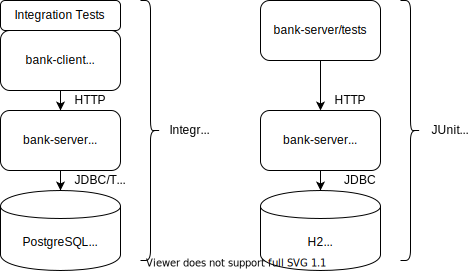

# Bank demo
This is simple demo of SpringBoot transactional application.
Simple Bank Demo provides following features:
* create and delete clients and accounts.
* deposit and withdraw funds.
* transfer funds between clients.
* PostgreSQL database is used to store transactional data in production.
* H2 in-memory database is used for JUnit testing. 



## Build and Test
JUnit tests are executes using *SpringBootTest* and *H2* embedded database.
```
gradle clean build test
```

## Full stack development with docker
Use docker to run PostgreSQL as docker container.
```
docker run -p 5432:5432 --name postgres-server -e POSTGRES_PASSWORD=secret -d postgres:12.3-alpine
java -jar bank-server/build/libs/bank-server-1.0.0-SNAPSHOT.jar
docker stop postgres-server
docker rm postgres-server
```

### Full stack Integration Tests
Use docker-compose to run complete stack:
1. postgresql on localhost:5432 as docker container
2. bank-server on localhost:8080 as docker container
```
#1. Start PostgreSQL Database and Bank-Server as docker containers 
docker-compose up --build -d
#2. Runt integration test suite
gradle :bank-client:clean :bank-client:test -Dtest.profile=integration
#3. tear down docker containers
docker-compose down -v --rmi all --remove-orphans
```
