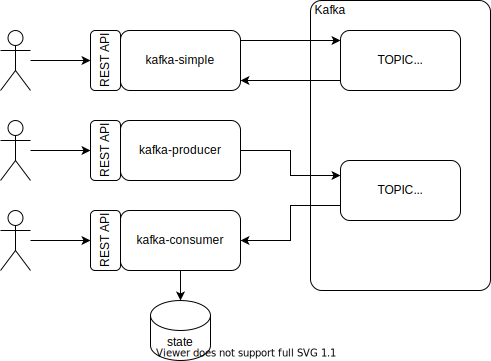

# Spring kafka demos

* [__kafka-simple__](kafka-simple) - request-response simple demo.
* [__kafka-producer__](kafka-producer) - app producing messages.
* [__kafka-consumer__](kafka-consumer) - app consuming messages.
* [__sync-producer-consumer-demo__](docs/Sync-Producer-Consumer-Demo.md)



## Compile & Run 
```
gradle clean build
java -jar kafka-simple/build/libs/kafka-simple-1.0.0-SNAPSHOT.jar --server.port=8080
java -jar kafka-producer/build/libs/kafka-producer-1.0.0-SNAPSHOT.jar --server.port=8081
java -jar kafka-consumer/build/libs/kafka-consumer-1.0.0-SNAPSHOT.jar --server.port=8091 --spring.kafka.consumer.group-id=group-01
```

## Download and Start kafka locally
Download [kafka](https://downloads.apache.org/kafka/2.6.0/kafka_2.13-2.6.0.tgz) and unzip
```
tar -xzf kafka_2.13-2.6.0.tgz
cd kafka_2.13-2.6.0

#start zookeeper and kafka
bin/zookeeper-server-start.sh config/zookeeper.properties
bin/kafka-server-start.sh config/server.properties

#create topic service-requests
bin/kafka-topics.sh --create --bootstrap-server localhost:9092 --replication-factor 1 --partitions 1 --topic simple-test-topic
bin/kafka-topics.sh --create --bootstrap-server localhost:9092 --replication-factor 1 --partitions 4 --topic prod-con-test-topic
```

## Start locally with docker-compose
See original [docker-compose.yml](https://raw.githubusercontent.com/bitnami/bitnami-docker-kafka/master/docker-compose.yml) file 
or [kafka on hub.docker.io](https://hub.docker.com/r/bitnami/kafka/). 
```
docker-compose up -d
docker-compose down
```
