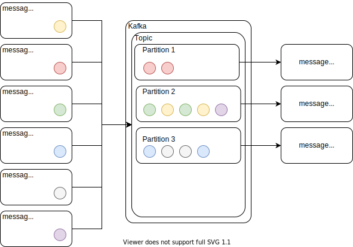

# Kafka Producer - Consumer demo



* __Partitioning:__ Kafka can guarantee ordering only inside the same 
  partition and it is therefore important to be able to route correlated 
  messages into the same partition. To do so you need to specify a key for 
  each message and Kafka will put all messages with the same key in the 
  same partition.
* The messages with the same key are guaranteed to be written to the same partition.

### Create Kafka Topics
```
bin/kafka-topics.sh --create --bootstrap-server localhost:9092 --replication-factor 1 --partitions 1 --topic sync-prod-con-requests
bin/kafka-topics.sh --create --bootstrap-server localhost:9092 --replication-factor 1 --partitions 1 --topic sync-prod-con-responses
```

### Start producer 
```
java -jar build/libs/kafka-sync-producer-1.0.0-SNAPSHOT.jar
```

### Start consumer
```
java -jar build/libs/kafka-sync-consumer-1.0.0-SNAPSHOT.jar
```

### Send Message
```
curl --location --request POST 'http://localhost:8082/services/messages' \
--header 'Content-Type: application/json' \
--data-raw '{
    "id": "id-001",
    "message": "hi"
}'
```