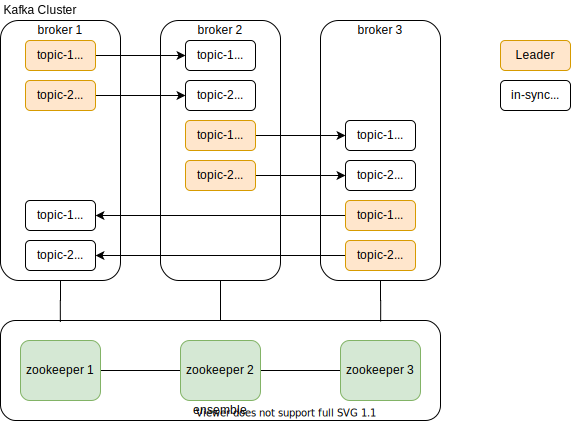
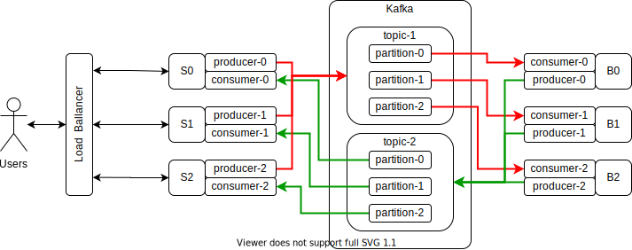

# Kafka 3-node cluster setup





## Start zookeeper cluster
```
bin/zookeeper-server-start.sh config/zookeeper1.properties
bin/zookeeper-server-start.sh config/zookeeper2.properties
bin/zookeeper-server-start.sh config/zookeeper3.properties
```

## Start broker cluster
```
bin/kafka-server-start.sh config/server1.properties
bin/kafka-server-start.sh config/server2.properties
bin/kafka-server-start.sh config/server3.properties
```

## Clean cluster state
```
rm -rf data/zookeeper1/version-2
rm -rf data/zookeeper2/version-2
rm -rf data/zookeeper3/version-2
rm -rf /tmp/kafka-logs-*
```

* [Blog](https://medium.com/@kiranps11/kafka-and-zookeeper-multinode-cluster-setup-3511aef4a505)
* [Blog](https://blog.newrelic.com/engineering/kafka-best-practices/)