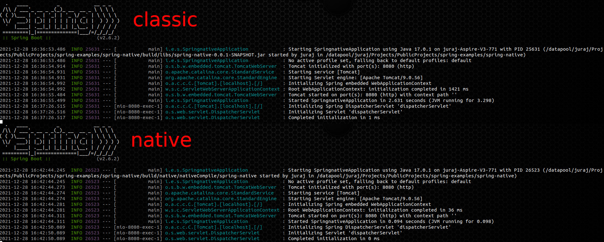

# Spring Native Demo
This is a simple demo of [Spring Native](https://docs.spring.io/spring-native/docs/current/reference/htmlsingle/) subsystem, 
compiling Spring applications to native executables using the [GraalVM native-image](https://www.graalvm.org/reference-manual/native-image/) compiler.

| Arch.   | Spring  | CPU               | Compile T. | Build Size | Docker Size | App Start | RSS Memory |
|---------|---------|-------------------|------------|------------|-------------|-----------|------------|
| amd64   | classic | AMD Ryzen 9 5950X | 7 s        | 17 M *     | 218.98 MB   | 0.84 s    | 484.332 MB |
| amd64   | native  | AMD Ryzen 9 5950X | 48 s       | 68 M       | 68.35 MB    | 0.032 s   | 49.824 MB  |
| amd64   | classic | i7-3632QM         | 21 s       | 17 M *     | 218.98 MB   | 3.298 s   | 461.360 MB |
| amd64   | native  | i7-3632QM         | 214 s      | 68 M       | 68.35 MB    | 0.098 s   | 50.004 MB  |
| arm64v8 | classic | Raspberry PI 4    | NA *       | 17 M *     | NA          | 10.997 s  | 169.416 MB |
| arm64v8 | native  | Raspberry PI 4    | NA *       | 67 M       | NA          | 0.161 s   | 71.820 MB  | 

* __Compilation Time__ - in case of classic spring build, the compilation time is to build classic springboot fat jar.
* __Compilation Time *__ - springboot graal native compilation requires a LOT OF memory, ~20G is recommended. 
  It is possible to [emulate ARMv64 VM on x86_64 hardware](https://github.com/jveverka/guildelines-and-procedures/tree/master/qemu) in case memory on ARMv64 system is not enough.
  Compilation on Raspberry PI4 8G was failing because of memory shortage, so this example was compiled on qemu ARM64 VM. 
* __Build Size__ - in case of classic build the build size is size of fat jar (only demo and dependencies) which does not include JVM and JVM libraries. JVM typically takes extra ~250MB.
* __Build Size *__ - in case of native build the resulting binary contains this demo, optimized java library stack and 'Substrate VM' as [described here](https://www.graalvm.org/reference-manual/native-image/).  
* __App Start__ - start time measured by SpringBoot framework printed in the log file.
* __RSS Memory__ - allocated measured after start and after REST APIS was exercised ``cat /proc/<pid>/status | grep VmRSS``. 



Check also [this](https://github.com/jveverka/java-17-examples/tree/master/examples/proxy-server) GraalVM native-image plain java application demo.

### Demo REST endpoints
* GET Message 
  ```
  curl --request GET --url http://localhost:8080/api/v1/data/message
  ```
* POST Message 
  ```
  curl --request POST \
  --url http://localhost:8080/api/v1/data/message \
  --header 'Content-Type: application/json' \
  --data '{
  "message": "Hi !"
  }'
  ```
  
## Build and Test

### Install Graal VM and tools
This procedure is valid for Ubuntu 20.04 amd64 and arm64v8 build servers.
```
sudo apt install zip unzip curl
sudo apt install build-essential libz-dev zlib1g-dev
curl -s "https://get.sdkman.io" | bash
sdk install java 21.3.0.r17-grl
sdk install gradle 7.3.3
gu install native-image
```

### Build Classic Fat jar
* Build classic springboot fat jar.
```
gradle clean build test jar
```
* Build docker with springboot fat jar.
```
export VERSION=0.0.1-SNAPSHOT
export ARCH=arm64v8
export ARCH=amd64
docker build -t jurajveverka/spring-native-classic:${VERSION}-${ARCH} \
  --build-arg ARCH=${ARCH} \
  -f Dockerfile.classic .
  
docker push jurajveverka/spring-native-classic:${VERSION}-${ARCH}
docker run -p 8080:8080 jurajveverka/spring-native-classic:${VERSION}-${ARCH}
``` 

### Build lightweight Container with Cloud Native Buildpacks
```
gradle clean build test bootBuildImage
docker run --rm -p 8080:8080 spring-native:0.0.1-SNAPSHOT
```

### Build Native Executable 
* Build native binary.
```
sdk use java 21.3.0.r17-grl
sdk use gradle 7.3.3
gradle clean build test nativeCompile
./build/native/nativeCompile/spring-native
```
* Build docker with native binary.
```
export VERSION=0.0.1-SNAPSHOT
export ARCH=arm64v8
export ARCH=amd64
docker build -t jurajveverka/spring-native-native:${VERSION}-${ARCH} \
  --build-arg ARCH=${ARCH} \
  -f Dockerfile.native .
  
docker push jurajveverka/spring-native-native:${VERSION}-${ARCH}
docker run -p 8080:8080 jurajveverka/spring-native-native:${VERSION}-${ARCH}
```

#### References
* [Spring Native](https://docs.spring.io/spring-native/docs/0.11.1/reference/htmlsingle/#overview)
* [GraalVM Native Image](https://www.graalvm.org/reference-manual/native-image/)
