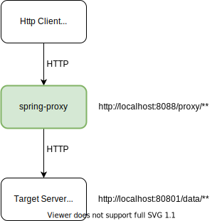

# Spring-boot Proxy Server
This demo shows simple spring boot proxy server used to access other REST service intercepting all requests.



### Build and run
```
gradle clean build test
java -jar build/libs/spring-proxy-1.0.0-SNAPSHOT.jar
```
